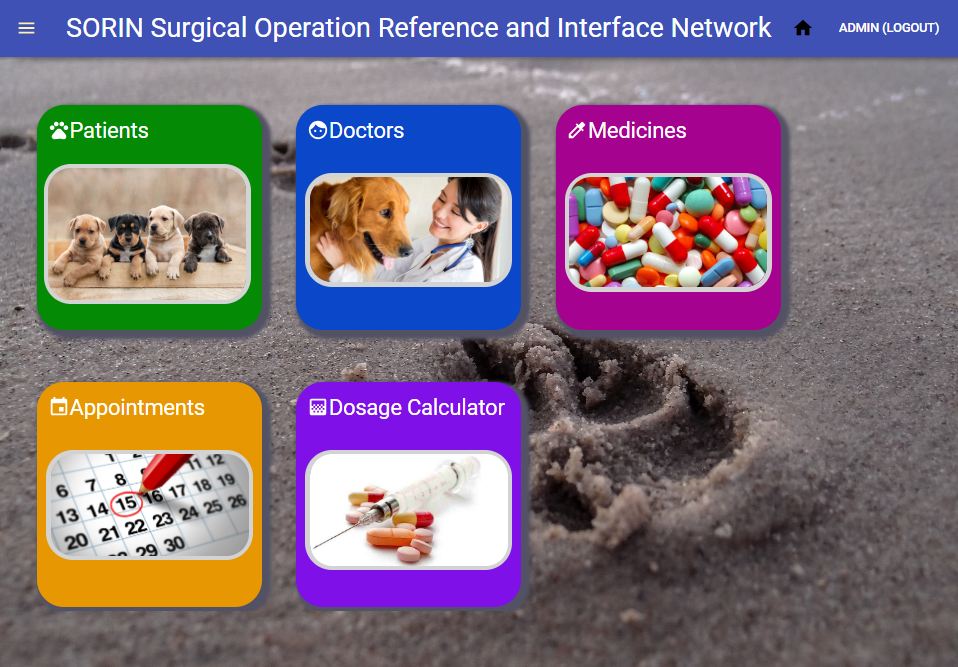
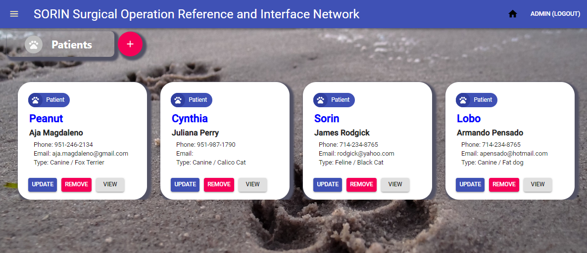

# SORIN

Surgical Operation Reference and Interface Network
Animal Clinic System

_by Aja Magdaleno, Tommy Dang, James Rodgick, Eddie Kader, Daniel Border, Sam Samawi, and Armando Pensado_ 


## Description

This project is a prototype for an animal clinic system, created to demonstrate the use of Mongo DB, Express, React, and Node JS technologies. This is an exercise that embodies a MERN single page application with React, and under MVC patern. 

The application provides functionality to add basic elements as Doctors, Patients, and medicines, which are used to create appointments or calculate medicine dosage for patients.

In addition, the application offers a restricted login functionality and the capability to send emails for Appointments and user accounts.

The application uses key **npm** components such as: _mongoose, react-dom, axios, nodemailer, password-hash, moment/react-moment_. 


## How does it works

As the application starts, there is an automatic setup routine that will seed basic elements into the database, providing a starting point.  One of these elements is the build-in account for the system administrator. With this account the admin user can initiate the individual setting for the application.

### Login 

The application opens with a login view. Different than other applications that allow user to sign up, for this application only authorized users can log into the system, as this is an internal application for the Animal clinic.  Authorized users are defined by the system administrator.


### Main Menu

Once proper credentials are provided, the application will present the home view, which has the main menu. This is a nontraditional menu, as the menu is represented by cards.  As the user select each card,  the system reveals more functionality.



The navbar offers two options on the right side, the option to return to the home view and logout. On the left, a ‘burger’ menu opens a left-drawer as an optional way to navigate through the application.

### Drawer Menu


The drawer contains an equivalent navigation option as the cards. However, the one single navigation option that is not represented by a card is the “Admin” menu option. This hidden in the drawer on purpose. This option is only meant for admin uses, capable to add additional user that can login into the system.  It is within the admin view that the user can add or remove user, except the built-in Admin account.

### System Admin 


Aside the basic data, a system user will have an “admin” checkbox to identify who has administration powers. Only administrators can navigate to all options offered by the system.  A regular user cannot add doctors, patients, and medicines, but will be able to set appointments, view medicine information, and use the dosage calculator.

As part of the user information, and email account is needed. If this is set, this will be use to notify the user via email about any change on their account. Adding, modifying or deleting a user will trigger an email to the user’s declared email account, informing them about the activity.

### Doctors and Patients

The functionality to add Doctors and patient is similar, but with differences in the fields. The offer a card with the information associated with them. In these screens, the user can create, update, or delete them. These views offer simple CRUD functionality.




### Appointments

For creating an appointment, it is required to define the title, description, date and time, and a doctor and patient. Creating, modifying, and deleting an appointment will trigger an email to both doctor and patient owner to inform them about this appointment.


### Dosage calculator

The Dosage calculator functionality helps determining the medicine suitable for the patient. This section will use a patient, doctor, and medicine information. The dosage will be determined based on the patient weight.

The view will bring possible presentation types for the medicine. By clicking the “calculate’ button, the system will offer the proper dosage to give the patient.


## Who can benefit from this application

This application is beneficial for NodeJS/React developer, providing a example programming structures using **React**, **JavaScript**, **Express**, **Mongo DB**, **mongoose (ODM)**, that encapsulate the logic to access the database.

## How developers can get started

To start, the developer must have NodeJS and Mongo DB installed in the computer. After that, the project can be cloned and initialized.  Here are the steps for getting started.

1. Install NodeJS into the computer  (https://nodejs.org/en/). Download button and run through the installation file.

2. Install Mongo DB and Compass (https://www.mongodb.com/)

3. Clone or Fork the project into the computer.

4. Bring all external module dependencies using VS Code terminal and type the command:

```js
npm i
```

After, the initialization, and using Microsoft Visual Code, the project folder should resemble as depicted below.


Before staring the application, and in order to see email functionality working, it is necessary to set an email account in Gmail that relax rules in order to be accessible programmatically.  Here is a link that provide explanation about how to make _nodemailer_ work with the Gmail account.

Username and Password nor accepted when using nodemailer?
https://stackoverflow.com/questions/45478293/username-and-password-not-accepted-when-using-nodemailer

Once the account is set, the user needs to manually add to the project a .env file at the root level that contains the credentials to access the Gmail account. The file will look as follows

```js
# .env file
# gmail email keys 
# open security account to allow emails from this application

EMAIL_USER=’Your Email account’
EMAIL_PWD='your password
```

Once the email configuration is in place, the developer can start the application by providing the following **npm** command.

```js
npm start
```

The application login should come up at this point.


## Who maintains and contributes to the project

This is a project for our personal learning process.

## Where users can get help with the project

* NodeJs   : https://nodejs.org/en/
* Express  : https://www.npmjs.com/package/express
* mongoDB  : https://www.mongodb.com/
* mongoose : https://mongoosejs.com/
* axios    : https://www.npmjs.com/package/axios
* React Organization: https://reactjs.org/
* Material UI : https://material-ui.com/
* nodemailer: https://www.w3schools.com/nodejs/nodejs_email.asp
* Username and Password nor accepted when using nodemailer? https://stackoverflow.com/questions/45478293/username-and-password-not-accepted-when-using-nodemailer


## Additional references

**Buillding a MERN application** 

https://github.com/pensadotech/MERN_BlankApp

**Implementing security with passport**

https://github.com/pensadotech/SecureSite