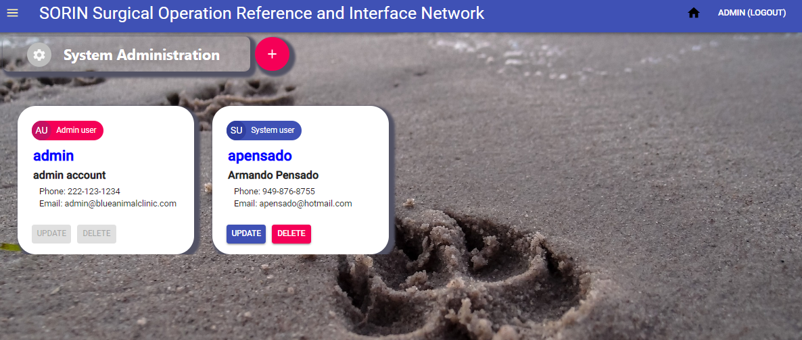

# SORIN

Surgical Operation Reference and Interface Network
Animal Clinic System (Prototype)

_by Aja Magdaleno, Tommy Dang, James Rodgick, Eddie Kader, Daniel Border, Sam Samawi, and Armando Pensado_ 


## Description

This project is a prototype for an animal clinic system, created to demonstrate the use of Mongo DB, Express, React, and Node JS technologies. This is an exercise that embodies a MERN single page application with React, and under MVC patern. 

The application provides functionality to add basic elements as Doctors, Patients, and medicines, which are used to create appointments or calculate medicine dosage for patients.

In addition, the application offers a restricted login functionality. Users defined as 'admin' will have full functionality, and regular users will be restricted to view key data only, but permitted to make appointments and calculate medicine dosages.

The application uses key **npm** components such as: _mongoose, react-dom, axios, nodemailer, password-hash, moment/react-moment_. 


## How does it works

As the application starts, there is an automatic setup routine that will seed basic elements into the database, providing a starting point.  One of these elements is the build-in account for the system administrator. With this account the admin user can initiate the individual setting for the application. The admin account and password must be provided with a **.env** file. Teh section '_How developers can get started_' offers how to add this file.

### Login 

The application opens with a login view. Different than other applications that allow user to sign up, for this application only authorized users can log into the system, as this is an internal application for the Animal clinic.  Authorized users are defined by the system administrator.


### Main Menu

Once proper credentials are provided, the application will present the home view, which has the main menu. This is a nontraditional menu, as the menu is represented by cards.  As the user select each card,  the system reveals more functionality.


The navbar offers two options on the right side, the option to return to the home view and logout. On the left, a ‘burger’ menu opens a left-drawer as an optional way to navigate through the application.

### Drawer Menu


The drawer contains an equivalent navigation option as the cards. However, there are two navigation options not represented in a card within the main view: a) Admin, and b) about us. These are hidden in the drawer as part of the design. The ‘Admin’ option is only meant for admin users, capable to add additional user that can login into the system.  It is within the admin view that the user can add or remove user, except the built-in Admin account. The ‘About us’ option offer information about the team that build the application.

### System Admin 



Aside the basic data, a system user will have an “AU” red label at the top to identify who has administration powers. Only administrators can add key information into the system.  A regular user can only see the information for patients, doctors and medicines, but will be able to set appointments and use the dosage calculator.

### Doctors and Patients

The functionality to add Doctors and patient is similar, but with differences in the fields. The offer a card with the information associated with them. In these screens, the user can create, update, or delete them. These views offer simple CRUD functionality.


### Medicines

The system offers the possibility to add medicines into the system. Aside from name, alias, and a controlled medicine indicator, the medicine can include characteristics for presentation types as Injectables, Tablet, Capsule, and suspension. 

The medicines view offers a table that allows the user to visualize the available options. By selecting the medicine name in the table, a view will offer details on the medicine. From there only user with admin rights can add, update, or delete medicines from the system.


### Appointments

The appointment view offers a calendar view that offers a month view. In here, the user can click in any day within the month and the system will offer a list of a appointments for the day, if available. The gray icon in a day inside the calendar indicates that there are appointments for the day. Its absence indicate that no appointments exist for the day.

To add a new appointment, the user can hit the add icon, on the right side of the main legend at the top of the view, in the calendar or the detail list for the day.

An appointment requires date and time, title, task, a doctor, and patient. 


### Dosage calculator

The Dosage calculator functionality helps determining the medicine suitable for the patient. This section will use a patient, doctor, and medicine information. The dosage will be determined based on the patient weight.

The view will bring possible presentation types for the medicine. By clicking the “calculate’ button, the system will offer the proper dosage to give the patient.


## Who can benefit from this application

This application is beneficial for NodeJS/React developer, providing a example programming structures using **React**, **JavaScript**, **Express**, **Mongo DB**, **mongoose (ODM)**, that encapsulate the logic to access the database.

## How developers can get started

To start, the developer must have NodeJS and Mongo DB installed in the computer. After that, the project can be cloned and initialized.  Here are the steps for getting started.

1. Install NodeJS into the computer  (https://nodejs.org/en/). Download button and run through the installation file.

2. Install Mongo DB and Compass (https://www.mongodb.com/)

3. Clone or Fork the project into the computer.

4. Bring all external module dependencies using VS Code terminal and type the command:

```js
npm i
```

After, the initialization, and using Microsoft Visual Code, the project folder should resemble as depicted below.


Before starting the application, the developer need to set an **.env** file to provide the initial admin keys used for the built-in account,  and the initial email keys needed for sending emails as there us activity in the account. The file must be created at the root level, and should look as follows, providing the proper user and passwords:

```js
# .env file
# gmail email keys 
# open security account to allow emails from this application

EMAIL_USER='Your Email account'
EMAIL_PWD='your password'
ADMIN_USER='admin'
ADMIN_PWD='Your admin key'

```

Additionally, in order to see email functionality working, it is necessary to set an email account in Gmail that relax rules in order to be accessible programmatically.  Here is a link that provide explanation about how to make _nodemailer_ work with the Gmail account.

Username and Password nor accepted when using nodemailer?
https://stackoverflow.com/questions/45478293/username-and-password-not-accepted-when-using-nodemailer


Once the **.env** file is inplace and the email configuration is set, the developer can start the application by providing the following **npm** command.

```js
npm start
```

The application login should come up at this point.


## Who maintains and contributes to the project

This is a project for our personal learning process.

## Where users can get help with the project

* NodeJs   : https://nodejs.org/en/
* Express  : https://www.npmjs.com/package/express
* mongoDB  : https://www.mongodb.com/
* mongoose : https://mongoosejs.com/
* axios    : https://www.npmjs.com/package/axios
* React Organization: https://reactjs.org/
* Material UI : https://material-ui.com/
* nodemailer: https://www.w3schools.com/nodejs/nodejs_email.asp
* Username and Password nor accepted when using nodemailer? https://stackoverflow.com/questions/45478293/username-and-password-not-accepted-when-using-nodemailer


## Additional references

**Buillding a MERN application** 

https://github.com/pensadotech/MERN_BlankApp

**Implementing security with passport**

https://github.com/pensadotech/SecureSite
