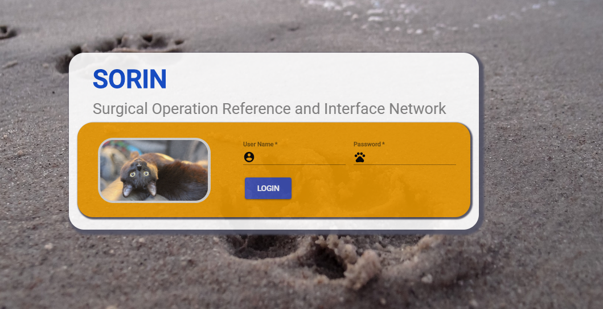
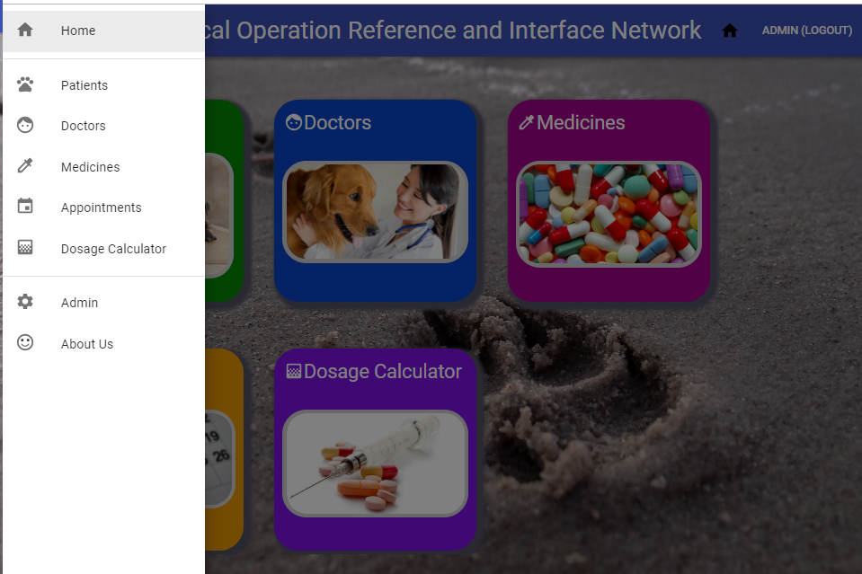
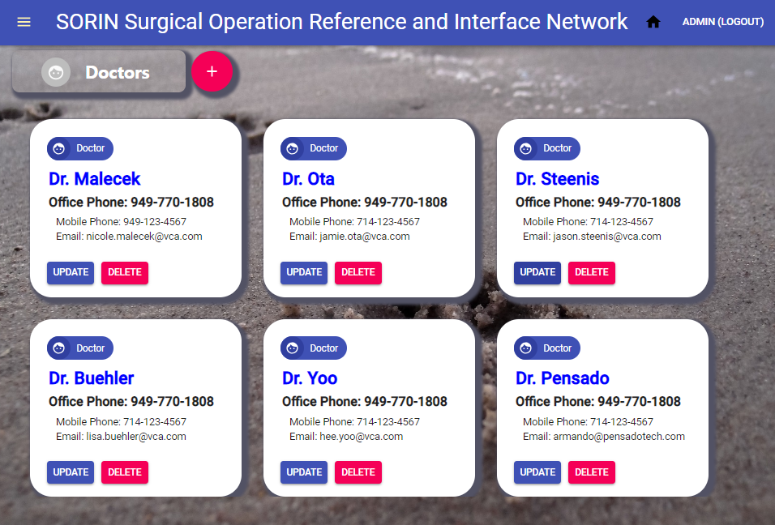
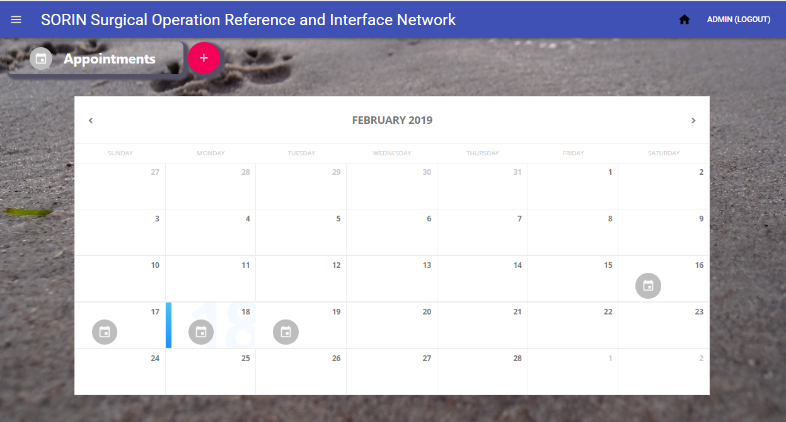
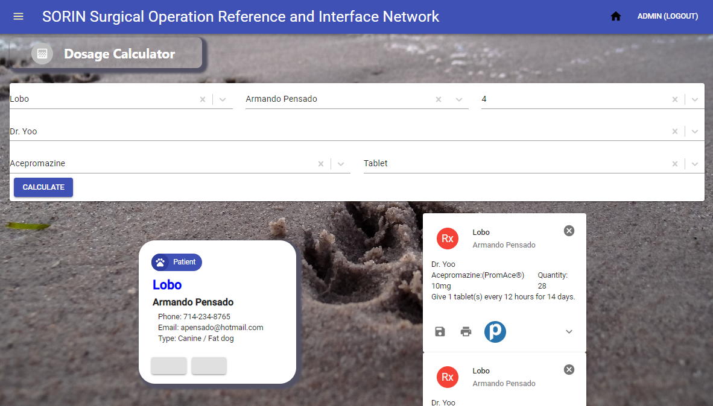

# SORIN

Surgical Operation Reference and Interface Network
Animal Clinic System

_by Aja Magdaleno, Tommy Dang, James Rodgick, Eddie Kader, Daniel Border, Sam Samawi, and Armando Pensado_ 


## Description

This project is a prototype for an animal clinic system, created to demonstrate the use of Mongo DB, Express, React, and Node JS. This is an exercise that embodies a MERN single page application with React. 

The application provides functionality to add basic elements as Doctors and Patients into the system, which are used to create appointments. Additionally, the system allows to enter medicines, that are used to compute the dosages for patients. 

The application offers a restricted login functionality implemented by using ‘passport’ and the capability to send emails for Appointments and user accounts. 


## How does it works

The application starts with a login view. Different than other applications that allow user to sign up, only authorized users can log into the system, as this is an internal application for the Animal clinic.  Authorized users are defined by the system administrator.



Once the proper credentials are provided, the application will present the home view, which has the main menu. This is a nontraditional menu, as the menu is represented by cards.  By selecting the cards the system changes view revealing more functionality.


The navbar offers two options on the right, the option to return to the home view and logout. On the left, a burger menu opens a left-drawer as an optional way to navigate through the application.




The one single navigation option that is not represented by a card is the “Admin” menu option. This hidden in the drawer on purpose. It is within the admin view that the user can add or remove user, expect the built-in Admin account.


The one single navigation option that is not represented by a card is the “Admin” menu option. This hidden in the drawer on purpose. It is within the admin view that the user can add or remove user, expect the built-in Admin account.

A system user, aside the basic data, will have an “admin” checkbox to identify who has administration powers. Only administrators can navigate to all options offered by the system. 

A regular user cannot add doctors, patients, and medicines, but will be able to set appointments, view madicne information, and use the dosage calculator.

Adding a new user, modifying or deleting a user will trigger an email to the user’s declared email account, informing them about the activity.

The functionality to add Doctors and patient is similar, but with differences in the fields. The offer a card with the information associated with them. In these screens, the user can create, update, or delete them. These views offer simple CRUD functionality.



For creating an appointment, it is required to define the title, description, date and time, and a doctor and patient. Creating, modifying, and deleting an appointment will trigger an email to both doctor and patient owner to inform them about this appointment.




The Dosage calculator functionality will use a patient, doctor, and medicine. The dosage will be determined base on the patient weight. 



## Who can benefit from this application

This application is beneficial for NodeJS/React developer, providing a sample programming structures using JavaScript, using **Express**, **Mongo DB**, **mongoose (ODM)**, and API routes that encapsulate the logic to access the database.

## How developers can get started

To start, the developer must have NodeJS and Mongo DB installed in the computer. After, that the project can be cloned and initialized.  Here are the steps for getting started.

1. Install NodeJS into the computer  (https://nodejs.org/en/). Download button and run through the installation file.

2. Install Mongo DB (https://www.mongodb.com/)

3. Clone or Fork the project into the computer.

4. Bring all external module dependencies using VS Code terminal and type the command:

```js
npm i
```
After, the initialization, and using Microsoft Visual Code, the project folder should resemble as depicted below, and should be ready for execution.


```js
npm start
```
The application will have no data, but should looks as depicted below.


## Who maintains and contributes to the project

This is a project for our personal learning process.

## Where users can get help with the project

* NodeJs   : https://nodejs.org/en/
* Express  : https://www.npmjs.com/package/express
* mongoDB  : https://www.mongodb.com/
* mongoose : https://mongoosejs.com/
* axios    : https://www.npmjs.com/package/axios
* React Organization: https://reactjs.org/
* Material UI : https://material-ui.com/


## Additional references

**Buillding a MERN application** 

https://github.com/pensadotech/MERN_BlankApp

**Implementing security with passport**

https://github.com/pensadotech/SecureSite